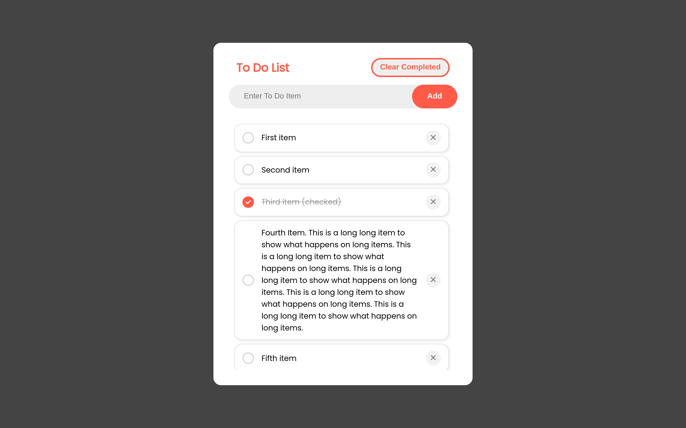
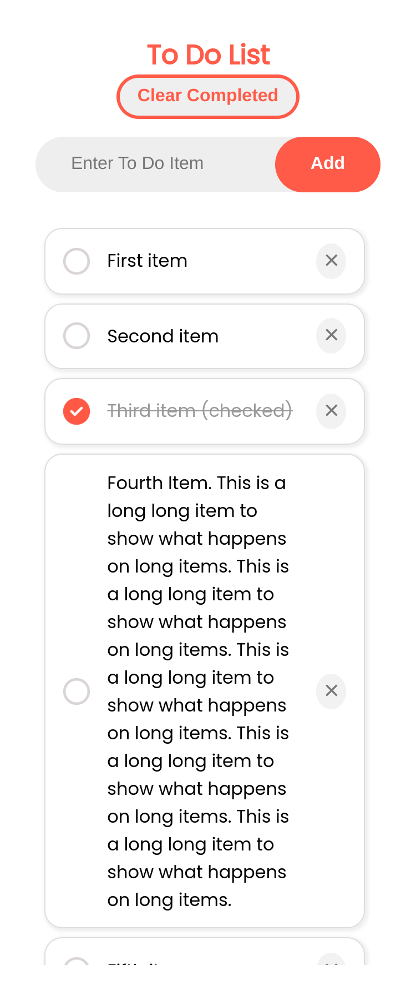

# To Do List App

## Author info

Made by Jobayed Islam.  
Student of Bogura Polytechnic Institute.  
Department: Computer Science & Technology.  
Semester: 4th  
Shift: 1st  
Roll: 715440  

## Project info

This is a simple To do list Application.  

It lets you enter a todo item at once and saves it to your borwser's local storage. It will remember the tasks you enter over page refresh.  
User can toggle between `checked` and `unchecked` state of each todo item.  

If any todo item is `checked`, the app will display a `clear completed` button automatically, to make clearing multiple checked items easier.  
User can scroll the list if there are more items.  

`User selection` on items are disabled to make the `checking` process smoother.  

There is also a custom scroll bar. It's not the one the borwser provides by default. I didn't have enough time to make it fully functional though. So it may glitch sometimes.  

I wanted to add some more styling, but again didn't have enough time on hand.

And you can open the browser console to see info about the author ;P  

## Screenshots

